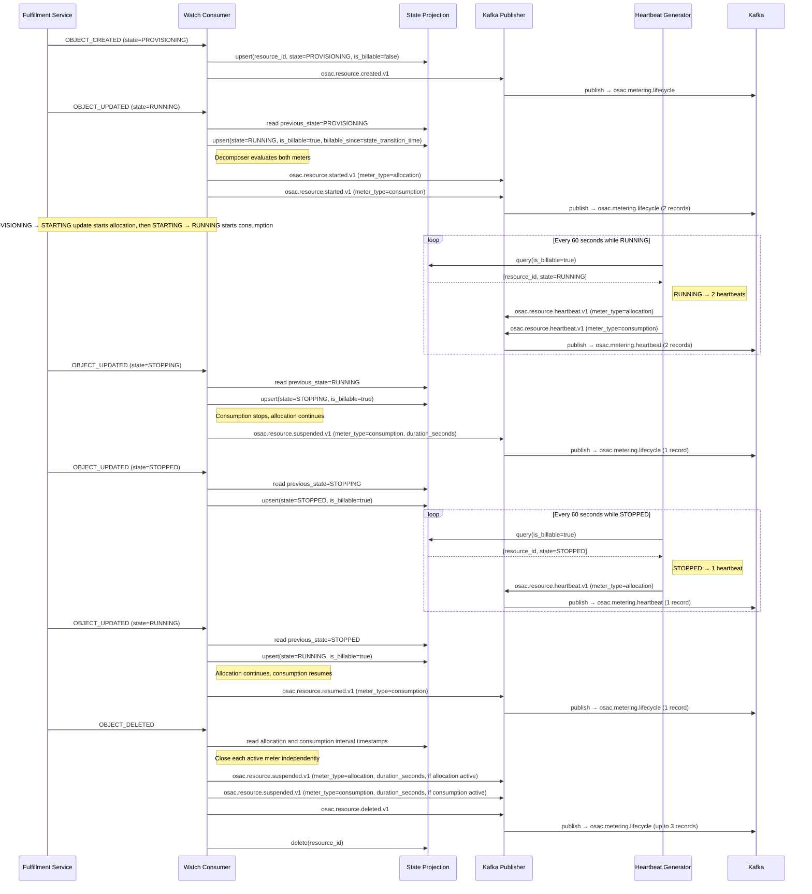
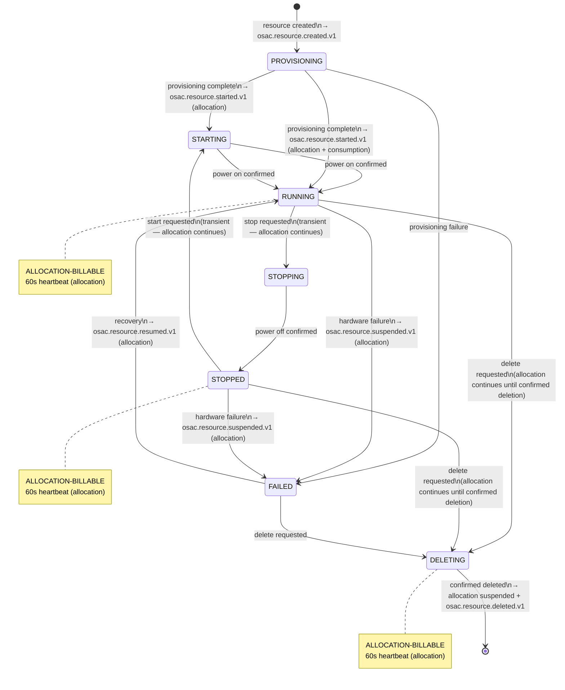

# BMaaS Metering (Part 2a)

## Summary

This design extends the OSAC Metering Service to meter bare metal hosts using a dual-meter event decomposition model: an allocation meter (`bare-metal-instance-type-seconds`) that runs from provisioning complete until the host enters `FAILED` or is deleted, regardless of power state, and a consumption meter (`bare-metal-compute-seconds`) that runs only while the host is powered on. A host in `FAILED` state is never billable for either meter. The design reuses the Part 1 metering infrastructure (Watch Consumer, State Projection, Heartbeat Generator, Reconciliation Loop, Kafka, Provider Adapters) and introduces a per-meter event decomposer that produces independent CloudEvent streams for each meter from a single Watch event. See [PRD](prd.md) for detailed requirements.

## Motivation

Part 1 (OSAC-985) established OSAC metering for VMaaS and CaaS — both consumption-based meters where `IsBillable` maps to a single boolean: `RUNNING` for VMs, `PROGRESSING`/`READY` for clusters. Bare metal hosts have a fundamentally different capacity profile. A bare metal host occupies physical rack space, a power port, and related networking infrastructure from the moment it is provisioned until it enters `FAILED` or is deleted — regardless of whether the tenant has powered it on. This physical capacity commitment has no equivalent in VMaaS (where stopped VMs release compute) or CaaS (where clusters are always running or failed).

The Part 1 design states that "_the canonical event model supports future resource types without architectural changes._" This holds for single-meter resources — adding BMaaS consumption-only metering would follow the exact `ComputeInstance` pattern. The dual-meter model is the exception: the existing single-boolean `IsBillable` projection, the single transition table per resource type, and the single-event-per-transition assumption all require targeted extensions. This design proposes those extensions while preserving backward compatibility with existing VMaaS and CaaS metering.

### Goals

1. **Reuse Part 1 infrastructure** — no new services, Kafka topics, or deployment artifacts; BMaaS metering is a code-level extension of the existing metering-service and adapter framework
2. **Extend, don't replace, the event decomposition pattern** — the CaaS `N+1` per-component decomposer is the precedent; BMaaS adds a per-meter decomposer that produces independent CloudEvent streams with independent event types
3. **Allocation and consumption meters are independently queryable** — each meter has a distinct `meter_type` billing dimension, so downstream systems can filter, aggregate, and price them separately
4. **No new metering API surface** — the existing `Events.Watch` stream carries the `spec.instance_type` reference introduced by [OSAC-1201](https://redhat.atlassian.net/browse/OSAC-1201); the fulfillment controller now exposes and populates `BareMetalInstanceStatus.state_transition_time` through merged [OSAC-4969](https://redhat.atlassian.net/browse/OSAC-4969)

### Non-Goals

- Storage and networking metering for resources attached to bare metal hosts ([OSAC-3141](https://redhat.atlassian.net/browse/OSAC-3141), [OSAC-3145](https://redhat.atlassian.net/browse/OSAC-3145))
- Usage Query API implementation or tenant-facing usage views; this design defines the event contract and unified-footprint semantics that a query implementation consumes
- Costing, billing, or quota enforcement
- Changes to the `BareMetalInstance` provisioning or lifecycle workflow

## Terminology

**Allocation Meter** — A billing stream that tracks capacity commitment for a bare metal host from provisioning complete (`RUNNING`, `STOPPED`, `STARTING`, `STOPPING`, and in-progress `DELETING` states) until the host enters `FAILED` or is confirmed deleted. Runs continuously across power cycles and deletion finalization while the host is not `FAILED`. Represents the physical rack space, power port, and networking infrastructure reserved by the provider for the tenant.

**Consumption Meter** — A billing stream that tracks actual compute usage for a bare metal host. Runs only when the host is powered on (`RUNNING` state). Independent of allocation; enables providers to charge separately for reserved capacity vs. active consumption.

**Billable State** — A resource state that incurs metering charges. Distinct per meter: allocation-billable states are `RUNNING`, `STOPPED`, `STARTING`, `STOPPING`, and in-progress `DELETING` (the host remains reserved); consumption-billable state is `RUNNING` only (the host is powered on). `FAILED` is non-billable for both meters, so no metering charges accrue while a host is in `FAILED` state.

**Transition Table** — A state machine table defining which state transitions trigger meter events (started, suspended, resumed). Independent transition table per meter; evaluated for each Watch event to determine which CloudEvents to produce.

**Event Decomposer** — A function that evaluates multiple transition tables (allocation + consumption) against a single Watch event and produces up to two CloudEvents, each with its own event type and meter-specific billing dimensions. BMaaS decomposer extends the CaaS precedent (N+1 per-component decomposition).

**Meter Type** — A billing dimension (`meter_type`) that discriminates between allocation and consumption events. Enables downstream systems to filter, aggregate, and price each meter independently. Carried in CloudEvent `billing_dimensions`, not as a CloudEvent extension attribute.

**Billing Dimensions** — Structured metadata attached to CloudEvents that describe resource attributes for billing purposes. BMaaS includes: `meter_type` (allocation or consumption), `bm_instance_type` (the BareMetalInstanceType resource ID, e.g., bmi-type-gpu-large), and `catalog_item` (e.g., bmi-gpu-workstation).

**State Projection** — A PostgreSQL-backed runtime view of resource state. Tracks `IsBillable`, `CurrentState`, `BillableSince`, and per-component billable timestamps (`ComponentBillableSince`). Used by the Heartbeat Generator to determine which resources are metering and the Watch Consumer to detect transitions.

**Watch Event** — A streaming event from the fulfillment-service when a resource's state changes. The Watch Consumer consumes `BareMetalInstance` Watch events, evaluates transition tables, and publishes CloudEvents to Kafka.

**CloudEvent** — A standardized event format (CNCF spec) published to Kafka. BMaaS CloudEvents include: event type (_e.g._, `osac.resource.started.v1`), meter-specific billing dimensions, tenant attribution, resource IDs, and timestamps. Consumed by provider adapters for billing integration.

**BareMetalInstanceType** — An OSAC resource that identifies a provider-defined bare metal hardware configuration. A `BareMetalInstance` references it through `spec.instance_type`; the reference is the primary pricing dimension for allocation and consumption meters.

## Proposal

The design introduces four changes to the metering-service codebase:

1. `bareMetalInstanceMapper` — a new `ResourceMapper` implementation that extracts metering data, including the `BareMetalInstanceType` reference, from `BareMetalInstance` Watch events, with `IsBillable()` returning allocation-billable (the broader meter)
2. **Dual-meter event decomposer** — a new `EventDecomposer` that evaluates two independent transition tables (allocation and consumption) per Watch event and produces up to two CloudEvents, each with its own CloudEvent type and `meter_type` billing dimension
3. **Extended reconciliation** — a `BareMetalInstancesClient` and loader for the hourly reconciliation loop, with a billability checker that uses the allocation meter's state set
4. **M360 adapter route** — a `/bmaas/event` endpoint that passes the `meter_type` billing dimension through to the M360 Usage API

No new Kafka topics or deployment artifacts are required. The shared State Projection gains one additive per-meter first-use field. The existing `osac.metering.lifecycle`, `osac.metering.heartbeat`, and `osac.metering.corrections` topics carry BMaaS events alongside VMaaS and CaaS events, differentiated by the `osacresourcetype` extension attribute (`bare_metal_instance`). Kafka's 30-day retention replays BMaaS events after they have been published, but cannot recover a transition that the fulfillment `Events.Watch` stream never delivered. Provider adapters persist published usage data for at least 13 months via their respective storage backends.

### Workflow Description

#### BMaaS Host Lifecycle — Dual-Meter Metering

When a Tenant Admin provisions a bare metal host, the Metering Service tracks both meters independently:



Key observations:

- `PROVISIONING` → `STARTING` establishes provisioning complete and produces one allocation `started.v1` event; the later `STARTING` → `RUNNING` transition opens consumption.
- `PROVISIONING` → `RUNNING` produces two `started.v1` events (both meters start simultaneously)
- `RUNNING` → `STARTING`, `STOPPING`, or direct `STOPPED` produces one `suspended.v1` for consumption; allocation continues
- `STOPPING` → `RUNNING` reopens consumption with `started.v1` or `resumed.v1` according to the per-meter first-use flag
- `STOPPED` → `RUNNING` produces one `resumed.v1` (consumption resumes; allocation unchanged)
- Any transition into `FAILED` suspends every active meter; a host in `FAILED` state produces no allocation or consumption heartbeats and accrues no charges
- `OBJECT_DELETED` closes each currently active meter independently, then produces one `deleted.v1` audit event. A meter that is already inactive (for example after `FAILED`) produces no synthetic suspension.
- Heartbeats vary by state: `RUNNING` produces two (allocation + consumption), `STOPPED`/`STARTING`/`STOPPING`/`DELETING` produce one (allocation only). Allocation heartbeat duration is measured from `BillableSince`; a `RUNNING` consumption heartbeat is measured from `ComponentBillableSince["consumption"]`.

### API Extensions

The Metering Service introduces no new CRDs, webhooks, or API surfaces. It consumes existing fulfillment-service private APIs:

- `Events.Watch` — the existing fulfillment event stream. BMaaS events are carried in `Event.bare_metal_instance` (field 3); field 15 is `secret`. The metering-service Watch filter must include the `bare_metal_instance` payload so these events reach the BMaaS mapper.
- `PrivateBareMetalInstancesService.List` — used by the Reconciliation Loop for drift detection
- The fulfillment deletion event contract must add an optional `google.protobuf.Timestamp deletion_completion_time` to the `Event` envelope for `OBJECT_DELETED`. Fulfillment sets it only after the BareMetalInstance has been removed and its finalizers have completed; `Metadata.deletion_timestamp` records the deletion request and is not a completion timestamp. The field and its value must be retained by the durable history/cursor API.

**BMaaS event ordering contract:** Because `Events.Watch` does not guarantee delivery order, BMaaS uses metering-service's existing internal `fulfillment_version` field. The resource mapper populates it from `BareMetalInstance.metadata.version`, which fulfillment increments on normal object updates and carries in reconciliation snapshots and durable-history payloads. The projection stores the highest contiguous `fulfillment_version` it has applied. `Event.id` remains the stable event identity for deduplication; it is not an ordering value or replay cursor. `OBJECT_DELETED` is a terminal exception: the current fulfillment deletion path can emit the deletion notification with the same metadata version as the preceding object event, so deletion is not rejected as numerically stale, but the consumer first verifies that the normal version sequence is complete and replays any missing history. It then guards the deletion with its stable event ID, required `deletion_completion_time`, and a deletion tombstone. Late normal events for a deleted resource are ignored.

**CloudEvent changes:** No new extension attributes. The existing `osacresourcetype` carries `bare_metal_instance`. The new `meter_type` value lives in `billing_dimensions`, not as a CloudEvent extension — it is a billing attribute, not an infrastructure routing key.

**Provider Adapter interface:** Unchanged. Adapters receive BMaaS events as standard `MeteringEvent` structs. The M360 adapter adds a `/bmaas/event` route.

## UX Alignment

No `@temp-api` file exists for metering resources in `osac-ux/libs/ui-components/src/api/v1/`. The Metering Service is a backend event pipeline; tenant-facing usage views are a separate design concern (Usage Query API).

### Implementation Details/Notes/Constraints

#### Dual-Meter Event Decomposition

The central architectural extension is a per-meter `EventDecomposer` for BMaaS. Unlike CaaS decomposition (which fans out one event type into `N+1` records with different billing dimensions), BMaaS decomposition fans out one Watch event into up to two records with **different CloudEvent types** and different billing dimensions per meter.

Two independent transition tables define each meter's billing boundaries:

`FAILED` is explicitly non-billable for both meters. Entering `FAILED` closes any active allocation and consumption intervals, and the heartbeat generator emits no events while the host remains in `FAILED`. Recovery from `FAILED` starts or resumes metering only after the host reaches a billable state (`RUNNING`); no time spent in `FAILED` is included in either meter.

**Allocation transition table** — billable states: `RUNNING`, `STOPPED`, `STARTING`, `STOPPING`, `DELETING` until the `OBJECT_DELETED` event confirms removal.

The resolver performs exact `(from, to)` lookups. The following is the complete accepted pair set; repeated snapshots are included explicitly and every row represents one registered pair. No wildcard transition is permitted. Pairs outside this set are invalid controller transitions and should be reported as configuration errors rather than silently interpreted.

`FAILED` is recoverable only through the explicitly registered `FAILED` → `RUNNING` path or by entering `DELETING`; repeated `FAILED` updates are accepted. `DELETING` is terminal until the deletion event, so only repeated `DELETING` updates are accepted. These rules are exact entries in the table, not wildcard fallbacks.

| From           | To             | Allocation Effect                     |
| -------------- | -------------- | ------------------------------------- |
| "" (initial)   | `PROVISIONING` | Skip                                  |
| ""             | `RUNNING`      | `billableStart`                       |
| ""             | `STOPPED`      | `billableStart`                       |
| ""             | `STARTING`     | `billableStart`                       |
| ""             | `STOPPING`     | `billableStart`                       |
| ""             | `FAILED`       | Skip                                  |
| ""             | `DELETING`     | `billableStart`                       |
| ""             | `UNSPECIFIED`  | Skip                                  |
| `PROVISIONING` | `PROVISIONING` | Skip                                  |
| `PROVISIONING` | `RUNNING`      | `billableStart`                       |
| `PROVISIONING` | `STOPPED`      | `billableStart`                       |
| `PROVISIONING` | `STARTING`     | `billableStart`                       |
| `PROVISIONING` | `STOPPING`     | `billableStart`                       |
| `PROVISIONING` | `FAILED`       | Skip                                  |
| `PROVISIONING` | `DELETING`     | Skip                                  |
| `RUNNING`      | `RUNNING`      | Skip                                  |
| `RUNNING`      | `STOPPED`      | Skip (still allocation-billable)      |
| `RUNNING`      | `STARTING`     | Transient (still allocation-billable) |
| `RUNNING`      | `STOPPING`     | Transient (still allocation-billable) |
| `RUNNING`      | `FAILED`       | Suspended                             |
| `RUNNING`      | `DELETING`     | Skip (allocation continues until deletion) |
| `STOPPED`      | `STOPPED`      | Skip                                  |
| `STOPPED`      | `RUNNING`      | Skip (still allocation-billable)      |
| `STOPPED`      | `STARTING`     | Transient (still allocation-billable) |
| `STOPPED`      | `FAILED`       | Suspended                             |
| `STOPPED`      | `DELETING`     | Skip (allocation continues until deletion) |
| `STARTING`     | `STARTING`     | Transient                             |
| `STARTING`     | `RUNNING`      | Skip (still allocation-billable)      |
| `STARTING`     | `STOPPED`      | Skip (still allocation-billable)      |
| `STARTING`     | `FAILED`       | Suspended                             |
| `STARTING`     | `DELETING`     | Skip (allocation continues until deletion) |
| `STOPPING`     | `STOPPING`     | Transient                             |
| `STOPPING`     | `STOPPED`      | Skip (still allocation-billable)      |
| `STOPPING`     | `RUNNING`      | Skip (still allocation-billable)      |
| `STOPPING`     | `FAILED`       | Suspended                             |
| `STOPPING`     | `DELETING`     | Skip (allocation continues until deletion) |
| `FAILED`       | `FAILED`       | Skip                                  |
| `FAILED`       | `RUNNING`      | `billableResume`                      |
| `FAILED`       | `DELETING`     | Skip                                  |
| `DELETING`     | `DELETING`     | Skip (allocation continues until deletion) |

An absent projection is represented as `""`. Watch processing uses the exact transition event and its authoritative timestamp. Reconciliation must replay durable history before initializing an absent projection: for a resource first observed in `RUNNING` after `PROVISIONING` → `STARTING` → `RUNNING`, it derives allocation from the first billable transition and consumption from the later `RUNNING` transition. It must not use the current-state timestamp as the allocation boundary. If durable history is unavailable or incomplete, reconciliation holds the correction and emits no guessed billable event. Once history has established the transition sequence, `RUNNING`, `STOPPED`, `STARTING`, `STOPPING`, and `DELETING` seed allocation; `RUNNING` also seeds consumption at its own transition timestamp. `PROVISIONING`, `FAILED`, and `UNSPECIFIED` seed neither meter. The `DELETING` seed remains allocation-billable until `OBJECT_DELETED` supplies `deletion_completion_time`.

**Consumption transition table** — billable state: `RUNNING` only. It registers the same complete pair set as the allocation table. `billableStart` opens consumption and resolves to `started.v1` or `resumed.v1` from the per-meter first-use state; `suspended` closes consumption at the transition timestamp. Every other registered pair is an explicit `Skip`.

| From           | To             | Consumption Effect |
| -------------- | -------------- | ------------------ |
| "" (initial)   | `PROVISIONING` | Skip               |
| ""             | `RUNNING`      | `billableStart`    |
| ""             | `STOPPED`      | Skip               |
| ""             | `STARTING`     | Skip               |
| ""             | `STOPPING`     | Skip               |
| ""             | `FAILED`       | Skip               |
| ""             | `DELETING`     | Skip               |
| ""             | `UNSPECIFIED`  | Skip               |
| `PROVISIONING` | `PROVISIONING` | Skip               |
| `PROVISIONING` | `RUNNING`      | `billableStart`    |
| `PROVISIONING` | `STOPPED`      | Skip               |
| `PROVISIONING` | `STARTING`     | Skip               |
| `PROVISIONING` | `STOPPING`     | Skip               |
| `PROVISIONING` | `FAILED`       | Skip               |
| `PROVISIONING` | `DELETING`     | Skip               |
| `RUNNING`      | `RUNNING`      | Skip               |
| `RUNNING`      | `STOPPED`      | `suspended`        |
| `RUNNING`      | `STARTING`     | `suspended`        |
| `RUNNING`      | `STOPPING`     | `suspended`        |
| `RUNNING`      | `FAILED`       | `suspended`        |
| `RUNNING`      | `DELETING`     | `suspended`        |
| `STOPPED`      | `STOPPED`      | Skip               |
| `STOPPED`      | `RUNNING`      | `billableStart`    |
| `STOPPED`      | `STARTING`     | Skip               |
| `STOPPED`      | `FAILED`       | Skip               |
| `STOPPED`      | `DELETING`     | Skip               |
| `STARTING`     | `STARTING`     | Skip               |
| `STARTING`     | `RUNNING`      | `billableStart`    |
| `STARTING`     | `STOPPED`      | Skip               |
| `STARTING`     | `FAILED`       | Skip               |
| `STARTING`     | `DELETING`     | Skip               |
| `STOPPING`     | `STOPPING`     | Skip               |
| `STOPPING`     | `STOPPED`      | Skip               |
| `STOPPING`     | `RUNNING`      | `billableStart`    |
| `STOPPING`     | `FAILED`       | Skip               |
| `STOPPING`     | `DELETING`     | Skip               |
| `FAILED`       | `FAILED`       | Skip               |
| `FAILED`       | `RUNNING`      | `billableStart`    |
| `FAILED`       | `DELETING`     | Skip               |
| `DELETING`     | `DELETING`     | Skip               |

The `RUNNING` → `STOPPING`, `RUNNING` → `STARTING`, and direct `RUNNING` → `STOPPED` transitions all close consumption while allocation remains active. `STOPPING` → `RUNNING` opens consumption again at that transition timestamp; the event is `started.v1` if consumption has never opened and `resumed.v1` otherwise. This explicitly handles a cancelled stop without leaving the consumption meter closed.

The decomposer evaluates both tables for each Watch event and produces one CloudEvent per meter that crosses a billing boundary. Transitions where neither meter crosses a boundary (_e.g._, `STOPPED` → `STOPPED`) produce no lifecycle events. Every lifecycle event receives the transition timestamp and the active interval for its own meter; the allocation and consumption intervals are never calculated from one shared timestamp.

`OBJECT_CREATED` and `OBJECT_DELETED` are fixed resource-level events and bypass the transition table. `OBJECT_DELETED` must nevertheless close active meter intervals before removing the projection row: it emits an allocation suspension only when `BillableSince` is present, a consumption suspension only when `ComponentBillableSince["consumption"]` is present, and then the audit deletion event. Before applying the deletion tombstone, the consumer verifies that the resource's normal `fulfillment_version` sequence is complete. If deletion arrives before a preceding update, it replays the missing durable history and applies those transitions before closing the intervals. If the history gap cannot be replayed, deletion processing is held and no closure or deletion event is emitted. The fulfillment-service team must add `deletion_completion_time` to this event and set it only after deletion has completed, including finalizer processing. `Metadata.deletion_timestamp` is the deletion-request time and must not be used for billing closure. The suspension duration uses `deletion_completion_time`; if it is absent, the consumer holds the closure for retry rather than using metadata deletion time or receipt time. The suspension IDs are `{baseID}/allocation` and `{baseID}/consumption`, and the deletion ID is `{baseID}`. Replayed or duplicated deletion notifications therefore resolve to the same IDs and cannot create duplicate billing intervals. A preceding `DELETING` update is not required for closure when the normal version sequence is complete.

**Deletion completion contract**

**Owner:** Fulfillment-service team.

**Implementation:** Add an optional `google.protobuf.Timestamp deletion_completion_time` field to the `Event` envelope. It is populated only for `EVENT_TYPE_OBJECT_DELETED`, after finalizer processing confirms that the `BareMetalInstance` has been removed and archived. The event payload remains the resource representation immediately before deletion; `deletion_completion_time` is the authoritative completion instant and is distinct from `Metadata.deletion_timestamp`, which records the deletion request.

**Ordering:** Fulfillment emits `OBJECT_DELETED` only after finalizer completion and sets `deletion_completion_time` before publication. Metering closes active intervals at that timestamp before publishing the deletion audit event.

**Replay:** The durable history/cursor record stores the field with the original event ID, resource payload, and event type. Replaying the event therefore reproduces the same completion timestamp and deterministic suspension IDs.

**Version skew:** Consumers that do not use the optional field may ignore it. BMaaS metering treats an `OBJECT_DELETED` event without `deletion_completion_time` as incomplete, retains it for retry, and never substitutes deletion-request time or event-receipt time.

**Tracking:** [OSAC-5096](https://redhat.atlassian.net/browse/OSAC-5096) tracks the fulfillment-service API change. BMaaS billing remains disabled until this dependency is implemented and verified.

**Impact:** Allocation closes at the actual deletion-completion instant, including finalizer time, and deletion cannot silently underbill the teardown interval.

```go
type BMaaSMeterIntervals struct {
    AllocationSince  *time.Time
    ConsumptionSince *time.Time
}

func DecomposeBMIEvents(
    billingDims map[string]any,
    baseID string,
    transitionTime time.Time,
    intervals BMaaSMeterIntervals,
    buildFn EventBuilder,
    allocType string,
    consumType string,
) ([]cloudevents.Event, error)
```

The decomposer receives the resolved CloudEvent types for each meter (or empty string if no boundary), plus the two active interval timestamps from `StateContext`. It computes `duration_seconds` as `transitionTime - intervals.AllocationSince` for allocation events and `transitionTime - intervals.ConsumptionSince` for consumption events. A consumer must not calculate one duration from `ResourceState.BillableSince` and reuse it for both meters. It builds independent events with deterministic IDs: `{baseID}/allocation` and `{baseID}/consumption`.

**CloudEvent ID contract:** The uniqueness scope is the `(source, id)` pair. Watch-originated lifecycle events use the fulfillment `Event.id` as `baseID` and the `osac-metering` source, matching the existing VMaaS and CaaS path. BMaaS meter fan-out appends `/allocation` or `/consumption`; the same fulfillment event therefore produces stable, distinct IDs for its meter records. `OBJECT_CREATED` and the deletion audit event retain the unmodified fulfillment event ID, while deletion closure records use the meter suffixes. Replaying or redelivering the same fulfillment event must reproduce the same IDs; different fulfillment events, including separate stop/start cycles, must produce different IDs.

Reconciliation corrections follow the shared deterministic correction namespace: `correction/{resource_id}/{reason}/{projection_state}/{source_state}/{correction_fingerprint}`. The fingerprint distinguishes different unresolved discrepancies without using reconciliation time, and BMaaS meter records append the same meter suffix. Heartbeat IDs use `hb/{resource_id}/{heartbeat_window_start_unix}/{meter_type}`; retries in one heartbeat window reproduce the same ID and the next window produces a different ID. Synthetic heartbeat IDs use `synthetic-hb/{resource_id}/{stale_reference_unix}/{meter_type}`. These generated prefixes keep heartbeat and correction IDs distinct from fulfillment event IDs. The `meter_type` suffix is an identity component, not a billing dimension.

#### BMaaS Pipeline Integration Contract

The BMaaS decomposer is an explicit resource-type handler in the existing Metering Service pipeline. The shared Watch, heartbeat, and reconciliation components call this handler through the following contract:

| Pipeline component | BMaaS integration contract |
| --- | --- |
| Watch filter and dispatcher | Subscribe to `Events.Watch` with `bare_metal_instance` enabled. Route `Event.bare_metal_instance` events to the BMaaS mapper and handler based on `osacresourcetype`; do not send them through a generic single-meter transition path. `OBJECT_DELETED` enters the BMaaS closure handler before the projection row is removed. |
| Mapper | Extract the BareMetalInstance resource ID, tenant/project metadata, the `spec.instance_type.id` from the `BareMetalInstanceTypeLocalReference`, catalog item, current state, authoritative `state_transition_time`, and map `metadata.version` to the metering-service mapper's `FulfillmentVersion()` value. For `OBJECT_UPDATED`, load the previous state, billing dimensions, per-meter interval timestamps, and last accepted `fulfillment_version` from the projection. `BareMetalInstanceBillingDimensions` returns an error when the instance-type reference or its ID is missing; the handler records the configuration error, does not advance the projection, and emits no billable lifecycle, heartbeat, correction, or outbox record. |
| Transition handler | Lock the projection before processing. For `OBJECT_CREATED` and `OBJECT_UPDATED`, if the mapper's `fulfillment_version` is less than or equal to the stored version, acknowledge the event as a stale or duplicate no-op; if it is greater than the stored version by more than one, hold the event and resume durable history from the missing version. Only the next contiguous version may resolve the exact `(previous_state, current_state)` pair in both BMaaS tables, update `CurrentState` and both meter intervals, and pass the resulting meter event specifications to `DecomposeBMIEvents`. `OBJECT_DELETED` is exempt from the numeric stale check because fulfillment may reuse the preceding metadata version, but the handler first replays any missing normal history, requires `deletion_completion_time`, and applies the tombstone once using its stable event ID. If the gap cannot be replayed, deletion is held without closure or deletion events. Persist the accepted version or tombstone, projection update, processed-event record, and outbox records in one PostgreSQL transaction; Kafka publication occurs after that transaction commits. |
| Event builder | Build each CloudEvent from the meter-specific event type, meter type, transition timestamp, duration, resource identity, and billing dimensions supplied by the decomposer. The allocation and consumption records use independent event IDs and never share a calculated duration. |
| Heartbeat generator | Query allocation-billable BMaaS projection rows, inspect `CurrentState`, and invoke the BMaaS heartbeat decomposer. It builds one allocation heartbeat for `STOPPED`, `STARTING`, `STOPPING`, and `DELETING`, and allocation plus consumption heartbeats for `RUNNING`, using each meter's own interval timestamp. |
| Reconciliation loop | Use the same mapper, transition tables, decomposer, event builder, and `OBJECT_DELETED` closure handler as Watch processing. A correction carries the authoritative fulfillment transition timestamp; it does not use reconciliation read time. Durable history replay is applied through this same path before snapshot drift correction. |

The event-builder contract is internal to the Metering Service and has the inputs required to reach the canonical CloudEvent schema:

```go
type BMaaSEventBuildRequest struct {
    EventType         string
    MeterType         string
    BaseID            string
    ResourceID        string
    PreviousState     string
    CurrentState      string
    TransitionTime    time.Time
    DurationSeconds   *int64
    BillingDimensions map[string]any
}

type EventBuilder func(BMaaSEventBuildRequest) (cloudevents.Event, error)
```

`DecomposeBMIEvents` creates one build request for each meter boundary, setting `DurationSeconds` from that meter's interval timestamp and setting the CloudEvent type to `started.v1`, `suspended.v1`, `resumed.v1`, or the applicable correction type. The dispatcher, heartbeat generator, and reconciliation loop must use this contract so `meter_type`, event type, transition timestamp, and meter-specific duration reach every emitted event.

#### Projection and Event Publication Idempotency

PostgreSQL and Kafka are not a single transaction. The Watch Consumer therefore uses a transactional outbox:

1. In one PostgreSQL transaction, it locks the resource projection, checks the source fulfillment event ID against the processed-event record, resolves the transition, updates the projection, and inserts one outbox record for each generated CloudEvent. The projection update and outbox inserts commit together or neither is committed.
2. The consumer acknowledges the fulfillment event only after that transaction commits. If the process crashes first, the fulfillment event is redelivered and the processed-event check makes the retry a no-op.
3. An outbox publisher reads committed records, publishes them to Kafka with producer acknowledgements, and marks them published only after Kafka confirms receipt. A crash after Kafka publication but before the outbox update can publish the record again; the CloudEvent ID remains deterministic, so adapters and downstream consumers must deduplicate by CloudEvent ID before aggregation.
4. The per-meter IDs (`{baseID}/allocation` and `{baseID}/consumption`) and the deletion IDs are stable across Watch redelivery, outbox retry, reconciliation correction, and durable-history replay. A duplicate therefore cannot create a second billable interval. A lost process cannot create an unrecorded projection transition because every committed projection change has a corresponding durable outbox record.

This outbox contract is the idempotency boundary for lifecycle events, heartbeats, corrections, and deletion closure. It does not claim atomicity between PostgreSQL and Kafka; it provides at-least-once publication with deterministic IDs and idempotent consumers.

**Outbox record contract:** The implementation uses two durable record sets:

- `processed_fulfillment_events` records the source `resource_type`, `resource_id`, `source_event_id`, source `metadata.version` when present, and processing timestamp. A unique constraint on `(resource_type, source_event_id)` makes source-event acknowledgement idempotent. An event is recorded even when its transition produces no CloudEvent.
- `metering_outbox` stores one row per CloudEvent with `outbox_id`, unique `cloud_event_id`, `resource_type`, `resource_id`, `meter_type`, CloudEvent type, serialized CloudEvent payload, optional `source_event_id`, optional source version, `record_kind` (`lifecycle`, `heartbeat`, `correction`, or `deletion`), creation timestamp, publication timestamp, attempt count, and the next retry time. The unique `cloud_event_id` constraint prevents a replay or transaction retry from inserting a second copy.

Lifecycle, heartbeat, correction, and deletion records use the same outbox and publisher path. Heartbeats and snapshot corrections have no fulfillment event ID; their deterministic CloudEvent ID is the idempotency key. Unpublished rows are never removed by cleanup. Published rows and processed-event records are retained for at least the greater of the durable fulfillment-history retention and the downstream deduplication horizon, with a default of 13 months to match provider usage retention. Cleanup may remove only published rows older than that retention, and must extend its horizon whenever either dependency is extended. Cleanup reports the age and count of unpublished rows so a stuck outbox cannot be mistaken for successful publication.

#### State Projection

The shared `ResourceState` projection gains one optional field for independent meter history. This is a Metering Service infrastructure extension owned by the Metering Service team; it does not change the VMaaS or CaaS billing model:

| Field                    | BMaaS Usage                                                                                                                                                   |
| ------------------------ | ------------------------------------------------------------------------------------------------------------------------------------------------------------- |
| `IsBillable`             | Allocation-billable (true for `RUNNING`, `STOPPED`, `STARTING`, `STOPPING`, `DELETING` until `OBJECT_DELETED`)                                                   |
| `EverBillable`           | Existing single-meter history retained for VMaaS/CaaS compatibility; BMaaS uses `ComponentEverStarted` for independent meter history                                  |
| `BillableSince`          | Start of the active allocation interval. It is set when allocation becomes billable and cleared after allocation suspension.                                  |
| `ComponentBillableSince` | `{"consumption": <time>}` — start of the active consumption interval. It is set on entry to `RUNNING` and cleared when consumption stops.               |
| `ComponentEverStarted`   | Optional persistent map, for example `{"allocation": true, "consumption": false}`. Each meter becomes true the first time its interval opens and remains true after suspension. |
| `CurrentState`           | BareMetalInstance state (`PROVISIONING`, `RUNNING`, `STOPPED`, _etc._)                                                                                        |
| `BillingDimensions`      | BM instance type, catalog item, and other BMaaS-specific dimensions                                                                                          |
| `FulfillmentVersion`     | Highest contiguous per-resource version accepted by the metering mapper (currently sourced from `BareMetalInstance.metadata.version`); persisted with the projection and its outbox records |

The Watch Consumer carries both timestamps and the per-meter first-use flags from the projection into `StateContext` and then into the decomposer. The consumption meter's `duration_seconds` on `suspended.v1` events is computed from `ComponentBillableSince["consumption"]`; the allocation meter uses `BillableSince`. On `RUNNING` → `STARTING`, `STOPPING`, or `STOPPED`, consumption is closed and its active timestamp is cleared while its `ComponentEverStarted["consumption"]` flag remains true. On a later transition to `RUNNING`, including `STOPPING` → `RUNNING`, a new consumption timestamp is set at that transition time and the event is `started.v1` or `resumed.v1` according to that flag; the allocation interval continues.

The field is additive and optional for existing resource types. VMaaS and CaaS retain their current `EverBillable` and component behavior, and their handlers ignore the BMaaS-only keys. The projection migration initializes the map empty for existing rows. BMaaS sets `ComponentEverStarted["allocation"]` or `ComponentEverStarted["consumption"]` atomically when the corresponding meter first opens, and chooses `started.v1` or `resumed.v1` from that flag. The projection update and corresponding outbox records are committed idempotently together; Kafka publication occurs after the PostgreSQL transaction commits.

`ComponentEverStarted` is intentionally retained because `BillableSince` and `ComponentBillableSince["consumption"]` describe only active intervals; they cannot distinguish the first consumption opening after `STOPPED` from a later resumed interval. `EverBillable` is resource-wide allocation history and cannot represent that distinction.

`ListBillable()` returns BMaaS resources that are allocation-billable. The heartbeat decomposer checks `CurrentState` to determine whether to produce one heartbeat (allocation only, for `STOPPED`/`STARTING`/`STOPPING`/`DELETING`) or two (allocation + consumption, for `RUNNING`).

#### BMaaS Watch Consumer State Application

The generic Watch Consumer's projection-only handling for transient states is not sufficient for BMaaS. The BMaaS handler loads the previous `ResourceState`, resolves the exact `(from, to)` pair, applies both meter effects, and persists the projection and deterministic lifecycle outbox records in one PostgreSQL transaction. A transition that leaves one meter unchanged still updates `CurrentState` so the heartbeat generator sees the correct power state.

Before resolving a normal transition, the handler compares the incoming mapper `fulfillment_version` with the projection's `FulfillmentVersion` while holding the projection lock. A version less than or equal to the stored value is acknowledged without changing the projection or emitting events. A version greater than the next expected value is held and replayed from the durable fulfillment history; it is never applied speculatively, because doing so could skip a billing boundary. `OBJECT_DELETED` does not advance `FulfillmentVersion`; it requires the completion timestamp and is deduplicated through its event ID and deletion tombstone. The accepted normal event advances `FulfillmentVersion` in the same transaction as the projection update, processed-event record, and outbox records. A projection without an established version is initialized by startup reconciliation or durable replay before live events are applied.

The meter-specific application rules are:

| Transition | Projection update | Lifecycle events |
| --- | --- | --- |
| `PROVISIONING` → `STARTING`/`STOPPING` | Set `BillableSince` to `state_transition_time`; set `ComponentEverStarted["allocation"]`; leave consumption inactive; set `IsBillable=true` | `started.v1` for allocation |
| `PROVISIONING` → `RUNNING` | Set `BillableSince` and `ComponentBillableSince["consumption"]` to `state_transition_time`; set both `ComponentEverStarted` flags and `IsBillable=true` | `started.v1` for allocation and consumption |
| `PROVISIONING` → `STOPPED` | Set `BillableSince` to `state_transition_time`; set `ComponentEverStarted["allocation"]`; leave consumption inactive; set `IsBillable=true` | `started.v1` for allocation |
| `STOPPED`/`STARTING` → `RUNNING` | Preserve `BillableSince`; set `ComponentBillableSince["consumption"]` to `state_transition_time`; set `ComponentEverStarted["consumption"]` if false | `started.v1` for a first consumption opening, otherwise `resumed.v1` |
| `FAILED` → `RUNNING` | Set active timestamps to `state_transition_time` for meters that open; set `IsBillable=true`; preserve and update each `ComponentEverStarted` flag | `started.v1` or `resumed.v1` independently for each meter, based on its flag |
| `RUNNING` → `STARTING`/`STOPPING`/`STOPPED` | Preserve `BillableSince`; clear the consumption timestamp; keep `IsBillable=true` | `suspended.v1` for consumption |
| `STOPPING` → `RUNNING` | Preserve `BillableSince`; set `ComponentBillableSince["consumption"]` to `state_transition_time`; keep `IsBillable=true` and update the consumption first-use flag | `started.v1` for the first consumption opening, otherwise `resumed.v1` |
| `STOPPING` → `STOPPED`, or `STOPPED` → `STARTING` | Preserve the allocation timestamp and consumption inactivity; keep `IsBillable=true` | No lifecycle event |
| `RUNNING`/`STOPPED`/`STARTING`/`STOPPING` → `DELETING` | Preserve `BillableSince`; clear the consumption timestamp if active; keep `IsBillable=true` until `OBJECT_DELETED` | Suspend consumption if active; allocation remains open |
| An allocation-billable state → `FAILED` | Clear `BillableSince` and any active consumption timestamp; set `IsBillable=false` | Suspend each meter that was active |

`started.v1` is reserved for the first opening of each meter interval. `resumed.v1` is used when that same meter opens again after suspension. A missing creation event is handled by replaying durable history through the same transition path as an initial Watch event. `RUNNING` seeds allocation at the first allocation-billable transition and consumption at the `RUNNING` transition; `STOPPED`, `STARTING`, `STOPPING`, and `DELETING` seed allocation from their historical boundary; and `FAILED` seeds neither. Reconciliation emits correction events with the same meter-specific effects and IDs. If history cannot establish the first allocation boundary, reconciliation holds the correction and emits no guessed billable event. A state snapshot cannot infer a completed stop/start cycle; replayable durable history is therefore a release prerequisite for the exact billing guarantee.

#### BareMetalInstanceType Resolution

The PRD's primary metering dimension is the `BareMetalInstanceType` selected for the host. OSAC-1201 exposes `spec.instance_type` as a `BareMetalInstanceTypeLocalReference` containing `id` and `name`. The canonical `bm_instance_type` value is the reference `id`, because it is the stable resource identity; the metering service does not dereference or rewrite it. The reference `name` is descriptive and is not used as the aggregation key. OSAC-1201 adds the field to `BareMetalInstance`; the Watch stream carries it with the resource:

```go
func BareMetalInstanceBillingDimensions(
    bmi *privatev1.BareMetalInstance,
) (map[string]any, error) {
    dims := map[string]any{}
    spec := bmi.GetSpec()
    if spec == nil || spec.GetInstanceType() == nil || spec.GetInstanceType().GetId() == "" {
        return nil, fmt.Errorf("missing spec.instance_type.id")
    }
    dims["bm_instance_type"] = spec.GetInstanceType().GetId()
    if ci := spec.GetCatalogItem(); ci != nil {
        dims["catalog_item"] = ci.GetName()
    }
    return dims, nil
}
```

The metering service does not resolve hardware metadata through `BareMetalInstanceType` List/Get calls and does not maintain a type cache or watch the type resource. The reference `id` identifies the billing dimension for each meter interval. Fulfillment validates that the reference is non-empty and immutable, and rejects attempts to update `spec.instance_type` after creation. A different instance type requires a new `BareMetalInstance`. Changes to descriptive or hardware metadata do not rewrite historical metering events. BMaaS metering requires a populated `instance_type.id`; a missing ID is a configuration error, and the mapper must return that error before the event can enter the billable pipeline.

#### BMaaS Billing Dimensions

BMaaS CloudEvents carry the following billing dimensions. Each event includes a `meter_type` discriminator:

**Lifecycle and heartbeat events:**

```json
{
  "meter_type": "allocation",
  "bm_instance_type": "bmi-type-gpu-large",
  "catalog_item": "bmi-gpu-workstation"
}
```

Here `bmi-type-gpu-large` is the `id` value carried in `spec.instance_type`.

```json
{
  "meter_type": "consumption",
  "bm_instance_type": "bmi-type-gpu-large",
  "catalog_item": "bmi-gpu-workstation"
}
```

The `meter_type` discriminator enables downstream systems to filter and price each meter independently. The `bm_instance_type` reference is the primary pricing dimension (analogous to `instance_type` for VMaaS). The `catalog_item` supports the PRD's queryability requirement (_CAP-3_).

Base event fields (`tenant_id`, `project_id`, `catalog_item_id`, `template_id`) are populated from the BareMetalInstance metadata and spec, following the same pattern as ComputeInstance.

#### BMaaS State Machine — Allocation Meter



Allocation-billable states: `RUNNING`, `STOPPED`, `STARTING`, `STOPPING`, and `DELETING` while deletion is in progress. The meter runs continuously across power cycles and deletion finalization. `FAILED` stops it immediately; `OBJECT_DELETED` closes it at the confirmed deletion timestamp.

#### BMaaS State Machine — Consumption Meter

```mermaid
stateDiagram-v2
    [*] --> PROVISIONING : resource created

    PROVISIONING --> RUNNING : provisioning complete\n→ osac.resource.started.v1 (consumption)

    RUNNING --> STARTING : restart requested\n→ osac.resource.suspended.v1 (consumption; allocation continues)
    RUNNING --> STOPPING : stop requested\n→ osac.resource.suspended.v1 (consumption; allocation continues)
    RUNNING --> STOPPED : direct stop\n→ osac.resource.suspended.v1 (consumption; allocation continues)
    RUNNING --> FAILED : hardware failure\n→ osac.resource.suspended.v1 (consumption)
    RUNNING --> DELETING : delete requested\n→ osac.resource.suspended.v1 (consumption)

    note right of RUNNING
        CONSUMPTION-BILLABLE
        60s heartbeat (consumption)
    end note

    STOPPING --> RUNNING : stop cancelled\n→ osac.resource.started.v1 or resumed.v1 (consumption)
    STOPPING --> STOPPED : confirmed stopped

    STOPPED --> STARTING : start requested\n(transient)
    STOPPED --> DELETING : delete requested

    STARTING --> RUNNING : power on confirmed\n→ osac.resource.resumed.v1 (consumption)

    FAILED --> RUNNING : recovery\n→ osac.resource.resumed.v1 (consumption)

    DELETING --> [*] : confirmed deleted
```



Consumption-billable state: `RUNNING` only. The consumption interval ends whenever the resource leaves `RUNNING`, including transitions to `STARTING`, `STOPPING`, `STOPPED`, `FAILED`, or `DELETING`. Those states produce allocation heartbeats only. A transition back to `RUNNING` opens a new consumption interval. `FAILED` is non-billable, so no time in `FAILED` is included until recovery to `RUNNING`.

#### Reconciliation

The Reconciler gains a `BareMetalInstancesClient` interface and `loadBareMetalInstances()` method, following the existing `loadComputeInstances()` and `loadClusters()` patterns:

```go
type BareMetalInstancesClient interface {
    List(ctx context.Context, in *privatev1.BareMetalInstancesListRequest,
        opts ...grpc.CallOption) (*privatev1.BareMetalInstancesListResponse, error)
}
```

The `billabilityCheckers` map gains an entry for `bare_metal_instance` that returns true for allocation-billable states (`RUNNING`, `STOPPED`, `STARTING`, `STOPPING`, `DELETING`).

Reconciliation corrections for BMaaS resources use the same decomposer as the Watch Consumer — a state drift correction that moves from `RUNNING` to `STOPPING` produces a consumption `suspended.v1` correction but no allocation correction. The correction uses the fulfillment transition timestamp; it cannot use the time at which the snapshot was read.

**Transient stop replay rule:** When the State Projection is `RUNNING` and a fulfillment snapshot is `STOPPED` or later, reconciliation must obtain the missing transition history before closing consumption. The fulfillment history response must contain the individual `RUNNING` → `STOPPING` transition and its authoritative timestamp. Reconciliation replays that transition through the BMaaS decomposer, emits the consumption suspension at the `STOPPING` timestamp, and then applies the later `STOPPED` state without creating another consumption suspension. It must never use the `STOPPED` snapshot timestamp as a substitute for the `STOPPING` boundary. If the history service cannot return the transition, reconciliation holds the correction for retry, reports that exact billing is unavailable for the interval, and does not publish a guessed billable duration.

**Reconciliation Interval:** Each hour, the reconciliation loop queries the fulfillment-service's `PrivateBareMetalInstancesService.List` API and compares the returned state against the State Projection. Endpoint drift (missed creations, a resource remaining in a different state, or a missing deletion) triggers correction events. The 60-minute interval is configurable via the `metering.reconciliation_interval_seconds` Helm value (default: 3600).

**Startup Reconciliation:** On metering-service startup, reconciliation runs immediately before the Watch Consumer resumes. It replays durable history to establish each absent projection's meter boundaries, then applies the current BareMetalInstance snapshot to repair endpoint drift. It does not use the snapshot's current-state timestamp as a missing allocation boundary or reconstruct transitions that are absent from durable history.

**Durable transition history requirement:** `List` is a snapshot API and cannot detect a complete `RUNNING` → `STOPPING`/`STOPPED` → `STARTING`/`RUNNING` cycle that occurs while Watch or Kafka is unavailable: both the source snapshot and the projection can end in `RUNNING`. Snapshot reconciliation therefore cannot recover the stopped interval or correct the consumption meter.

The current fulfillment `Events.Watch` contract does not provide this history. Its proto explicitly makes no guarantee about delivery or order, events that occur while the client is disconnected are not delivered, and the API has no replay cursor. `Event.id` identifies an event but is not a cursor or ordering guarantee. Merged [OSAC-4969](https://redhat.atlassian.net/browse/OSAC-4969) provides the authoritative `state_transition_time` in BMaaS status; it does not change these Watch delivery semantics.

**Blocking release gate — durable fulfillment transition history/cursor:** BMaaS MUST NOT be deployed with billing enabled until fulfillment provides the replay contract below. This is required to satisfy the Part 1 exact lifecycle billing guarantee for outages that can contain a complete transient cycle. Snapshot reconciliation and event receipt timestamps cannot substitute for replayable history.

**Owner:** Fulfillment-service team

**Implementation:** Provide an ordered, replayable stream or history endpoint with a durable per-consumer cursor or sequence, stable event ID, the complete resource payload including `BareMetalInstance.metadata.version`, event type, authoritative transition timestamp, and retention long enough to cover the maximum metering outage. Cursor resumption must define inclusive/exclusive semantics and allow the metering service to acknowledge progress after idempotently applying each event. The reconciliation snapshot already exposes the resource metadata, so startup reconciliation can establish the metering mapper's `FulfillmentVersion`; durable replay must preserve the same source version and event ID. The metering service will resume from that cursor before applying replayed events.

**Impact:** Until this dependency is available, BMaaS billing cannot be enabled. Reconciliation is limited to endpoint corrections and cannot reconstruct an unseen cycle.

#### Heartbeat Generation

The heartbeat decomposer for BMaaS checks `ResourceState.CurrentState`:

| State      | Heartbeat Events            |
| ---------- | --------------------------- |
| `RUNNING`  | 2: allocation + consumption |
| `STOPPED`  | 1: allocation only          |
| `STARTING` | 1: allocation only          |
| `STOPPING` | 1: allocation only          |
| `DELETING` | 1: allocation only          |
| `FAILED`   | 0                           |

Each heartbeat carries its own `meter_type` in billing dimensions and a deterministic event ID: `{base-hb-id}/allocation` and `{base-hb-id}/consumption`.

The heartbeat builder calculates `duration_seconds` independently for each emitted record: `now - ResourceState.BillableSince` for allocation and `now - ResourceState.ComponentBillableSince["consumption"]` for a `RUNNING` consumption heartbeat. It never uses `BillableSince` for the consumption record. A consumption heartbeat is suppressed when the consumption timestamp is absent; an allocation heartbeat is suppressed when the allocation timestamp is absent. This preserves the separate intervals across stop/start cycles.

**Heartbeat consumer contract:** `duration_seconds` is a cumulative snapshot from the start of the active meter interval to the heartbeat timestamp; it is not a delta from the previous heartbeat. Consumers must deduplicate by CloudEvent ID and must not sum repeated heartbeat snapshots. Lifecycle events are the authoritative interval boundaries: `started.v1` and `resumed.v1` open a meter interval, while `suspended.v1` closes it at its transition timestamp. For an active interval, consumers retain the greatest accepted cumulative duration and ignore an older snapshot. Providers must aggregate allocation and consumption independently by `meter_type`, close and reset the relevant aggregation after its lifecycle boundary, and begin a new cumulative series when the next interval opens. A previous interval's heartbeat duration must never carry into a new interval. This contract applies independently to allocation and consumption heartbeats.

#### M360 Adapter

The M360 adapter adds a `/bmaas/event` route alongside the existing `/vmaas/event`, `/caas/event`, and `/maas/event` routes. BMaaS events are translated to M360's flat payload format with `meter_type` passed through as a field. The M360 API treats allocation and consumption events identically — the `meter_type` is metadata for M360's own aggregation and pricing logic.

The echo adapter requires no changes — it stores all CloudEvents by ID regardless of resource type.

#### Parent-Child Attribution

The PRD requires storage volumes and public IPs attached to a bare metal host to be queryable as a unified usage view (_CAP-5_ acceptance criterion). This is an attribution and query relationship, not a second meter for the attached resources. The ownership boundary is:

- [OSAC-3141](https://redhat.atlassian.net/browse/OSAC-3141) owns the block-volume meter (`GiB-seconds`) for every volume, including volumes attached to bare metal hosts.
- [OSAC-2506](https://redhat.atlassian.net/browse/OSAC-2506) owns the bare metal host-resource meters and the unified bare metal host footprint view that rolls already-metered child usage into the host view.
- [OSAC-3145](https://redhat.atlassian.net/browse/OSAC-3145) owns the public-IP/networking meter, including for resources attached to bare metal hosts.

OSAC-2506 does not emit a second block-volume or public-IP meter event. Child-resource events owned by OSAC-3141 and OSAC-3145 carry the parent relationship in the canonical event data:

```json
{
  "resource_id": "volume-123",
  "resource_type": "block_volume",
  "parent_resource_id": "bmi-456",
  "parent_resource_type": "bare_metal_instance"
}
```

`parent_resource_id` is the direct parent's stable resource ID and `parent_resource_type` identifies its resource kind. These are optional top-level event-data fields, rather than CloudEvent extension attributes or billing dimensions. Parent host events omit both fields. The canonical event schema and field semantics are owned by the Part 1 metering-service team.

OSAC-3141 and OSAC-3145 are responsible for discovering attachment ownership and populating the parent fields for the portion of a child meter interval during which the attachment exists. An attach or detach operation closes the prior child interval and opens a new one at its authoritative attachment timestamp. A child resource can have only one direct parent in an event; nested roll-ups are the responsibility of the query layer.

The parent-child contract has two parts. At the event level, each child meter event retains its owning resource, meter type, units, and direct parent fields; the parent host events retain the host `resource_id` and omit parent fields. At the usage level, the Usage Query API accepts `parent_resource_type`, `parent_resource_id`, a time range, and the caller's tenant/project scope. It returns the host-resource meters plus the already-metered child usage attributed to that parent, preserving each child's resource ID, meter type, unit, and attachment-bounded interval without emitting or counting a duplicate child meter.

**Owner:** Metering team, with the Part 1 metering-service team owning the canonical event fields and OSAC-3141/OSAC-3145 owning attachment discovery and child-meter attribution.

**Implementation:** The Metering team implements the Usage Query API contract, including the parent filters, authorization, pagination, and response shape. The [OSAC-985 metering design](../OSAC-985-metering-and-usage-tracking/design.md) identifies this API as a planned companion design; no dedicated Usage Query API design exists yet in this workspace. OSAC-3141 and OSAC-3145 populate attachment-bounded `parent_resource_id` and `parent_resource_type` fields in their child events. No duplicate child meter is emitted.

**Impact:** The unified-footprint acceptance criterion (CAP-5) remains blocked until the canonical parent fields, child attribution, and Usage Query API are available. The query returns host-resource meters and already-metered child usage without double-counting it.

### Security Considerations

BMaaS metering inherits the existing security model without changes:

- The metering-service consumes the fulfillment-service **private** Watch stream, authenticated via mTLS (Kubernetes service mesh). No new authentication paths are introduced.
- Tenant isolation is enforced by the fulfillment-service's OPA policies — the metering-service receives all BareMetalInstance events across tenants and attributes them via `tenant_id` from the resource's metadata. The metering-service itself performs no authorization checks; it is a trusted internal consumer.
- CloudEvents published to Kafka carry `osactenant` extension attributes for downstream tenant-scoped filtering.
- No sensitive data is added to CloudEvents beyond what Part 1 already exposes (resource IDs, tenant IDs, states, billing dimensions).

### Failure Handling and Recovery

| Failure Mode                                    | Effect                                                              | Recovery                                                                                                                                                                | User Observation                                                                  |
| ----------------------------------------------- | ------------------------------------------------------------------- | ----------------------------------------------------------------------------------------------------------------------------------------------------------------------- | --------------------------------------------------------------------------------- |
| Watch stream disconnect                         | Missed BareMetalInstance transitions                                | Durable Watch history is replayed from the last cursor. Snapshot reconciliation handles endpoint drift only; it cannot reconstruct a complete cycle that returns to the same state.                                      | BMaaS billing is not enabled unless replayable transition history is available |
| Kafka publish failure                           | Events buffered in metering-service; backpressure on Watch Consumer | Kafka producer retries with exponential backoff. If buffered events are lost, the durable fulfillment history/cursor dependency must replay them; snapshot reconciliation can repair endpoint drift only. | Delayed event availability; exact billing remains dependent on replayable history |
| Reconciliation detects missed BareMetalInstance | Resource was created but Watch event was lost                       | Reconciliation replays durable history, emits `correction.v1 (reason=missed_creation)`, and seeds the projection from historical boundaries; it holds the correction if the boundary is unavailable | Downstream system receives correction with an accurate interval, or no guessed billable duration |
| Metering-service restart mid-lifecycle          | In-memory state projection lost                                     | PostgreSQL-backed projection survives restarts. Durable Watch history replays the gap; startup reconciliation repairs endpoint drift when no transient cycle was missed.                   | No user-visible impact when replayable history is available                         |

### RBAC / Tenancy

No RBAC or tenancy changes required. BMaaS metering is a backend pipeline that reads from the fulfillment-service private API, which already enforces tenant isolation via OPA. The metering-service is a cluster-scoped internal service, not tenant-facing. All CloudEvents carry `tenant_id` for downstream attribution.

### Observability and Monitoring

New Prometheus metrics for BMaaS metering:

| Metric                                          | Type    | Labels                     | Description                                          |
| ----------------------------------------------- | ------- | -------------------------- | ---------------------------------------------------- |
| `osac_metering_bmi_events_total`                | Counter | `meter_type`, `event_type` | BMaaS lifecycle events produced, by meter and type   |
| `osac_metering_bmi_heartbeats_total`            | Counter | `meter_type`               | BMaaS heartbeat events produced, by meter            |

Existing metrics (`osac_metering_reconciliation_corrections_total`, `osac_metering_reconciliation_duration_seconds`) gain `bare_metal_instance` as a new `resource_type` label value. No new alerts — existing reconciliation and Kafka health alerts cover BMaaS.

### Risks and Mitigations

| Risk                                                                                                                                           | Mitigation                                                                                                                                                                                                                                                                      |
| ---------------------------------------------------------------------------------------------------------------------------------------------- | ------------------------------------------------------------------------------------------------------------------------------------------------------------------------------------------------------------------------------------------------------------------------------- |
| **Dual-meter decomposition complexity** — the per-meter decomposer is a novel pattern not used by VMaaS or CaaS, increasing maintenance burden | The decomposer is self-contained in `bare_metal_instance.go` and isolated behind the `EventDecomposer` interface. Unit tests cover all (from, to, meter) combinations via the two transition tables.                                                                            |
| **Blocking release gate: durable fulfillment transition history/cursor** — the current `Events.Watch` stream does not guarantee delivery or order and cannot replay events missed during disconnects | Fulfillment-service team must provide the ordered replay contract described in the Reconciliation section. BMaaS billing remains disabled until it is available. |
| **OSAC-1201 dependency** — BareMetalInstanceTypes must be defined and referenced before BMaaS metering is useful                                  | [OSAC-1201](https://redhat.atlassian.net/browse/OSAC-1201) defines the `BareMetalInstanceType` resource, requires a non-empty `BareMetalInstance.spec.instance_type.id` reference, and makes that reference immutable. Fulfillment rejects updates after creation; a different instance type requires a new `BareMetalInstance`. |
| **Deletion completion timestamp dependency** — metadata records deletion requested, not deletion completed | [OSAC-5096](https://redhat.atlassian.net/browse/OSAC-5096) tracks the fulfillment-service change to add `deletion_completion_time` to `OBJECT_DELETED` and durable history after finalizers complete. Metering closes allocation at that timestamp and waits for it when absent. |
| **Parent attribution/query dependency** — the current canonical event schema, child-meter designs, and Usage Query API do not yet define the parent relationship contract | The Part 1 metering-service team must add the optional parent fields; OSAC-3141 and OSAC-3145 must populate them for attachment-bounded child intervals; the Metering team must implement the parent query contract. CAP-5 remains blocked until these contracts are available. |
| **Part 1 not yet deployed** — BMaaS metering depends on the metering-service infrastructure from OSAC-985                                      | Part 1 design is complete; implementation is in progress. BMaaS metering code can be developed in parallel but cannot be deployed or tested end-to-end until Part 1 infrastructure is operational.                                                                              |

### Drawbacks

The dual-meter decomposition pattern introduces a precedent: a single OSAC resource producing multiple independent billing streams from one Watch event. This is architecturally clean but increases the surface area of the event decomposition layer. Future resource types with multi-meter requirements (_e.g._, GPU instances with allocation + compute + memory meters) would follow this pattern, which could lead to combinatorial growth in transition table coverage.

The alternative — treating each meter as a fully independent virtual resource with its own projection row — would be structurally simpler per-meter but would double the projection store size for BMaaS resources and require changes to the Store interface (composite keys instead of resource ID alone). The decomposition approach was chosen because it preserves the 1:1 resource→projection invariant and reuses the existing CaaS decomposition machinery.

## Alternatives (Not Implemented)

### A1: Two Projection Rows per Resource

Treat allocation and consumption as independent virtual resources: `bare_metal_instance:allocation:{id}` and `bare_metal_instance:consumption:{id}`, each with its own `ResourceState` row, `IsBillable`, and heartbeat cycle.

**Pros:** Each meter is fully independent; no decomposer needed; heartbeat generator works without state inspection.
**Cons:** Doubles projection store size for BMaaS; breaks the 1:1 resource ID → projection row assumption used by reconciliation, missed-deletion detection, and stale-version checks; requires Store interface changes for composite keys; `ListBillable()` would return two rows per host in RUNNING state.
**Rejected because:** The projection schema change would ripple through the reconciler, heartbeat generator, and Watch Consumer for all resource types, not just BMaaS.

### A2: Single Transition Table with Union Boundaries

Use one transition table where every row that crosses a boundary for either meter produces an event, and embed both meters' effects in the `TransitionResult`:

```go
type TransitionResult struct {
    AllocationEventType  string
    ConsumptionEventType string
    Transient            bool
    Skip                 bool
}
```

**Pros:** Single table, explicit per-transition effect for both meters.
**Cons:** Changes the `TransitionResult` struct used by all resource types (VMaaS, CaaS); requires adapting `resolveTransition()` and all callers.
**Rejected because:** Modifying shared types forces changes in VMaaS and CaaS code paths that have no dual-meter requirement.

### A3: Consumption-Only Metering (Single Meter)

Meter BMaaS like VMaaS — `RUNNING` only. Drop the allocation meter.

**Pros:** Zero architectural changes; exact ComputeInstance pattern.
**Cons:** Does not meet PRD requirements. The allocation meter (_CAP-1_) is the primary requirement — providers need to track capacity commitment for physically reserved hardware regardless of power state.
**Rejected because:** Fails to meet the PRD.

## Open Questions

### 1. state_transition_time Availability for BMaaS

**STATUS: RESOLVED; IMPLEMENTATION MERGED** — [OSAC-4969](https://redhat.atlassian.net/browse/OSAC-4969) tracks the fulfillment change, which has merged. It adds `BareMetalInstanceStatus.state_transition_time` and populates it on every state change. The fulfillment version consumed by BMaaS metering must include this merged change.

The Watch event's receipt time is not a valid substitute: Watch disconnects, Kafka backlog, consumer backlog, and reconciliation can delay delivery by minutes or hours. The metering service must not estimate a transition timestamp from event receipt time, use a missing timestamp to advance either meter interval, or publish a billable lifecycle, correction, or heartbeat event for a state whose transition timestamp is unavailable. It must retain or reject the event for retry and surface the missing field as a dependency failure.

The transition timestamp is carried from `BareMetalInstanceStatus` through the Watch Consumer and `StateContext` into the per-meter decomposer. Reconciliation also requires the same timestamp and cannot infer it from the time that a snapshot is read. Once the controller supplies the field, the fulfillment event stream must preserve it for replay and correction processing.

**Owner:** Platform team (`BareMetalInstance` controller) / Amit Oren (amoren@redhat.com)
**Implementation:** [OSAC-4969](https://redhat.atlassian.net/browse/OSAC-4969) added `optional google.protobuf.Timestamp state_transition_time` to `BareMetalInstanceStatus`, populates it whenever the state transitions, and follows the pattern in `ComputeInstanceStatus`. The value must be preserved in every Watch payload and replay path.
**Impact:** The state-transition timestamp prerequisite is satisfied once BMaaS consumes a fulfillment version containing OSAC-4969; no receipt-time fallback is permitted.

### 2. Exact Part 1 Billing Guarantee During Watch Outages

**STATUS: RESOLVED IN DESIGN; RELEASE GATE** — The PRD requires BMaaS meters to use the same accuracy and data-availability guarantees as Part 1, while the current fulfillment `Events.Watch` API cannot replay transitions missed during a disconnect. Snapshot reconciliation cannot reconstruct a complete transient cycle that starts and ends in the same state.

Durable fulfillment transition history with cursor-based replay is a release-blocking prerequisite for the Part 1 guarantee. The design does not weaken the guarantee or use `List` reconciliation as a substitute. Research of the current fulfillment implementation found only the live `Events.Watch` subscription; it has no history store or cursor, and its proto documents that disconnected events are lost. BMaaS billing cannot be enabled until the contract above is implemented.

**Owner:** OSAC-2506 product/design owners and the fulfillment-service team
**Impact:** BMaaS deployment and billing remain blocked until the durable replay contract is implemented and verified.

### 3. BareMetalInstance.spec.instance_type Immutability

**STATUS: RESOLVED** — OSAC-1201 defines `spec.instance_type` as a `BareMetalInstanceTypeLocalReference` with `id` and `name`, requires a non-empty reference, and makes it immutable after creation. Fulfillment rejects attempts to update the reference. BMaaS uses the reference `id` as the canonical `bm_instance_type` dimension; a different instance type requires a new `BareMetalInstance`.

**Owner:** OSAC-1201/fulfillment-service team
**Impact:** Metering can treat `bm_instance_type` as stable for the lifetime of a BareMetalInstance and does not need a dimension-rollover path.

## Graduation Criteria

BMaaS metering remains disabled until all release gates below pass.

### Fulfillment Dependencies

- The consumed fulfillment-service version includes OSAC-4969 `state_transition_time`.
- Durable BMaaS history retains events for at least 30 days.
- Replay uses a per-consumer cursor with documented inclusive/exclusive semantics.
- A replayed event is acknowledged only after its projection and outbox transaction commits.
- `OBJECT_DELETED` always includes `deletion_completion_time`; missing timestamps hold processing and emit no closure or deletion event.
- `spec.instance_type.id` is non-empty and immutable for the consumed API version.

### Correctness

- Every accepted transition-table pair has a passing unit test.
- Initial reconciliation derives the first allocation boundary from durable history, not the current-state timestamp.
- Replay of a complete `RUNNING → STOPPED → RUNNING` cycle restores the stopped interval exactly once.
- Duplicate and out-of-order events produce no duplicate billing intervals.
- Allocation and consumption duration error is no greater than one second for 30-second, 120-second, and 600-second test intervals.
- Repeated heartbeat snapshots are nondecreasing within an interval and are not summed as deltas.
- At least two consecutive hourly reconciliation cycles complete with zero unexpected BMaaS corrections in a clean test environment.

### Regression and Operations

- Existing VMaaS and CaaS unit, integration, and E2E suites pass without regression.
- The BMaaS lifecycle E2E test passes for create, start, stop, restart, failure, recovery, and deletion.
- Replay-lag alert fires when lag exceeds five minutes for five minutes.
- Unpublished outbox alert fires when the oldest unpublished record exceeds five minutes.
- Missing `state_transition_time` or `deletion_completion_time` produces a critical alert immediately.
- Fulfillment-service owns history and timestamp alerts; the Metering team owns outbox, replay, and reconciliation alerts.

### Scope

- CAP-5 is either delivered through the parent usage query contract or explicitly moved to a separate release/feature before Dev Preview approval.

## Test Plan

### Unit Tests

- `bareMetalInstanceMapper` extracts resource type, ID, tenant, project, catalog item, instance type, and state from a `BareMetalInstance` proto
- `BareMetalInstanceBillingDimensions()` populates `bm_instance_type` from the non-empty `spec.instance_type.id` reference and populates `catalog_item` from the BareMetalInstance spec
- `BareMetalInstanceBillingDimensions()` returns a configuration error for a missing `spec.instance_type.id`; the handler emits no billable event or outbox record
- An attempted `spec.instance_type` update is rejected by fulfillment and produces no dimension-rollover event; a different instance type requires a new `BareMetalInstance`
- `PROVISIONING` → `STOPPED` sets only `ComponentEverStarted["allocation"]` and emits allocation `started.v1`
- `PROVISIONING` → `STARTING`/`STOPPING` sets only `ComponentEverStarted["allocation"]` and emits allocation `started.v1`
- The first `STOPPED` → `RUNNING` sets `ComponentEverStarted["consumption"]` and emits consumption `started.v1`; a later stop/start cycle emits consumption `resumed.v1`
- `IsAllocationBillableState()` returns true for `RUNNING`, `STOPPED`, `STARTING`, `STOPPING`, `DELETING`; false for `PROVISIONING`, `FAILED`, `UNSPECIFIED`
- Initial reconciliation replays durable history before seeding; for `STARTING`, `STOPPING`, and `DELETING` it derives `BillableSince`, sets `IsBillable`, and produces allocation heartbeats, while `PROVISIONING`, `FAILED`, and `UNSPECIFIED` do not seed allocation
- `IsConsumptionBillableState()` returns true for `RUNNING` only
- Allocation transition table registers every pair in the explicit accepted transition set, including repeated snapshots and all provisioning/transient paths
- Consumption transition table registers the same complete pair set with the correct meter-specific effect
- BMaaS event handling ignores duplicate and stale mapper `fulfillment_version` values without changing the projection or emitting events
- BMaaS event handling holds a `fulfillment_version` gap, replays the missing durable history, and applies normal events only in contiguous version order
- `OBJECT_DELETED` closes the meters once using its event ID and deletion tombstone even when its metadata version equals the preceding event
- Redelivery of one fulfillment event reproduces the same lifecycle IDs; two distinct stop/start source events produce distinct allocation and consumption IDs
- `DecomposeBMIEvents()` produces 0, 1, or 2 events per transition based on meter boundary crossings:
  - `PROVISIONING → RUNNING`: 2 events (allocation started + consumption started)
- `RUNNING` → `STARTING`: 1 event (consumption suspended)
- `RUNNING` → `STOPPING`: 1 event (consumption suspended)
- `RUNNING` → `STOPPED`: 1 event (consumption suspended)
- `STOPPING` → `RUNNING`: 1 event (consumption started or resumed)
  - `STOPPED` → `RUNNING`: 1 event (consumption resumed)
  - `RUNNING` → `DELETING`: 1 event (consumption suspended; allocation remains active)
  - `STOPPED`/`STARTING`/`STOPPING` → `DELETING`: 0 events (allocation remains active)
  - `RUNNING` → `FAILED`: 2 events (allocation suspended + consumption suspended)
  - `FAILED` → `RUNNING`: 2 events (allocation resumed + consumption resumed)
  - `PROVISIONING` → `STOPPED`: 1 event (allocation started; consumption remains inactive)
  - `STOPPED` → `STARTING`: 0 events (allocation remains active; consumption remains inactive)
  - `OBJECT_DELETED` with both intervals active: 2 suspensions plus 1 deletion audit event, with stable IDs on redelivery
  - `OBJECT_DELETED` with no active intervals: deletion audit event only
  - `STOPPED` → `STOPPED`: 0 events
- Heartbeat decomposer produces 2 heartbeats for `RUNNING`, 1 for `STOPPED`/`STARTING`/`STOPPING`/`DELETING`, and 0 for `FAILED`
- Heartbeat retries in one window reproduce the same per-meter IDs, while consecutive heartbeat windows produce distinct IDs
- Repeated allocation and consumption heartbeats for the same active interval have nondecreasing cumulative durations; consumers deduplicate and do not aggregate them as deltas
- Reconciliation billability checker uses allocation-billable states
- Correction event decomposer produces per-meter corrections matching the state drift direction

### Integration Tests

- Reconciliation replays durable history for a `BareMetalInstance` present in fulfillment but missing from projection, then emits a `missed_creation` correction with the historical allocation boundary; it holds the correction if history is incomplete
- Reconciliation replays a `RUNNING` → `STOPPING` transition when the projection has `RUNNING` and fulfillment has `STOPPED`, emitting a correction for the consumption meter only; allocation remains billable
- Release gate: reconciliation replays a complete `RUNNING` → `STOPPED` → `RUNNING` cycle during a simulated Watch outage and restores the stopped interval from the replayed transitions before BMaaS billing is enabled.
- Watch delivers BMaaS events out of order; the handler holds the newer event, replays the missing version, applies both in order, and emits no duplicate events on redelivery.
- Durable history replays a direct `OBJECT_DELETED` event without a preceding `DELETING` update; the integration test verifies allocation and consumption closure at `deletion_completion_time`, not `Metadata.deletion_timestamp` or receipt time, and verifies stable IDs on replay.
- An `OBJECT_DELETED` event without `deletion_completion_time` is held without suspension, deletion-audit, or projection-closure outbox records; retrying after the timestamp becomes available emits the closure exactly once.
- Reconciliation detects a BareMetalInstance in projection but absent from fulfillment and emits `missed_deletion` correction
- Stale heartbeat detection generates synthetic heartbeats for allocation-billable BMaaS resources with correct meter decomposition
- Disabling `bmaas_metering_enabled` suppresses BMaaS Watch handling, heartbeats, reconciliation corrections, deletion cleanup, and outbox publication while retaining projections and queued records; re-enabling resumes replay and drains the retained outbox before heartbeats.
- Outbox insertion is idempotent by CloudEvent ID for lifecycle, heartbeat, correction, and deletion records; cleanup retains unpublished rows and removes only published rows beyond the configured replay and deduplication horizon.

### E2E Tests

- Full BMaaS lifecycle: create host → wait for `RUNNING` → verify allocation and consumption events in echo adapter → stop host → verify consumption suspended, allocation heartbeats continue → start host → verify consumption resumed → delete host → verify both meters suspended
- Verify echo adapter stores events with correct `meter_type` billing dimension
- Verify event `duration_seconds` accuracy: stop a host after a known interval and assert the consumption `suspended.v1` event's `duration_seconds` is within tolerance

## Upgrade / Downgrade Strategy

This is a new metering capability with no upgrade impact on existing VMaaS/CaaS metering. The metering-service binary gains BMaaS support — on upgrade, it begins consuming BareMetalInstance Watch events and producing CloudEvents. On downgrade, BMaaS events stop being produced; no cleanup is needed since Kafka topics are shared and BMaaS events are differentiated by `osacresourcetype`.

The State Projection adds an optional `ComponentEverStarted` JSONB field alongside the existing `ComponentBillableSince` field. Existing rows with no map deserialize as an empty map; BMaaS reconciliation seeds the flags according to the documented current-state rules, and missing `consumption` is treated as `false`. BMaaS updates the map atomically with the projection and outbox records. VMaaS and CaaS ignore the optional field, and readers that do not use BMaaS leave it untouched, so the field is safe for mixed-version storage and rollback.

## Version Skew Strategy

The metering-service is a standalone deployment — it does not run alongside a previous version during upgrades. The fulfillment-service Watch stream is backward-compatible (new event payload types are additive). If the metering-service is upgraded before the fulfillment-service has BareMetalInstance support, the metering-service simply receives no BareMetalInstance events (Watch subscription is filtered by resource type). No coordination is required beyond ensuring the fulfillment-service includes BareMetalInstance in its Watch stream.

## Support Procedures

**Detecting BMaaS metering failures:**

- `osac_metering_bmi_events_total` flatlines while `BareMetalInstance` lifecycle changes are occurring → Watch Consumer is not receiving BMaaS events
- `osac_metering_reconciliation_corrections_total{resource_type="bare_metal_instance"}` consistently > 0 → Watch Consumer is missing events; investigate Watch stream connectivity

**BMaaS metering feature gate:** `bmaas_metering_enabled` is evaluated at every BMaaS emission path and is independent of VMaaS/CaaS processing:

- The Watch dispatcher does not apply new BMaaS events or advance the durable replay cursor while the gate is disabled; re-enablement resumes from the last acknowledged cursor.
- The heartbeat generator excludes BMaaS rows from `ListBillable()` processing.
- The reconciliation loop skips BMaaS snapshot comparison, correction generation, missed-deletion cleanup, and projection closure.
- The outbox publisher leaves queued BMaaS records pending. It does not publish, delete, or synthesize BMaaS records while the gate is disabled.

Disabling BMaaS metering is therefore a pause. Existing BMaaS projection rows and queued outbox records are retained; no new lifecycle, heartbeat, correction, or deletion-closure events are generated. Events already published before disablement are not withdrawn. VMaaS/CaaS processing continues normally.

**Re-enabling:** Set `bmaas_metering_enabled=true`. The metering service resumes durable history from the last acknowledged cursor, drains the retained BMaaS outbox, runs BMaaS reconciliation, and only then resumes BMaaS heartbeats. This preserves open intervals and allows deletion closure to use the authoritative completion timestamp after a pause.

## Infrastructure Needed

No new metering deployment artifacts are required. BMaaS metering depends on the fulfillment-service durable transition history/cursor and deletion completion timestamp contracts described above, in addition to the existing metering-service binary, Kafka topics, PostgreSQL State Projection, and Provider Adapter framework.

---

## Provenance

Committed: commit @ design 0.9.1 - f121df6, workspace feat/OSAC-2506-metering-design @ e77a1aa

> Authoring phases not recorded this session (commit-time snapshot only).

<!-- ai-workflow-provenance:{"schema_version":1,"provenance_kind":"commit_only","workflow":"design","workflow_version":"0.9.1","ai_workflows":"f121df6","source_repo":"e77a1aa","source_repo_branch":"feat/OSAC-2506-metering-design","commits_behind_main":0,"commits_ahead_main":47,"main_ref":"main","phases":["commit"],"authoring_modes":["skill"],"context_changed":false,"origin_untracked":false} -->
